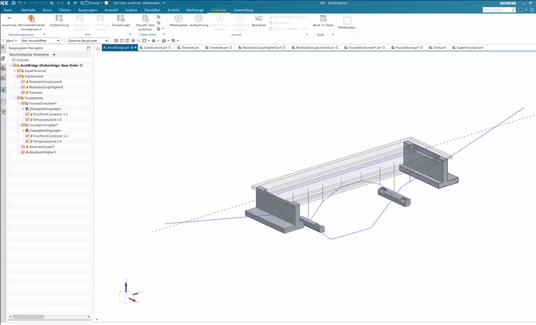

# NX-Plugin for mass customization of modular arch bridge system

## Context

This repository contains a software prototype that allows the automated product model generation for a modular bridge system. The underyling concepts are described in the following conference article:

Kolbeck, L.; Vilgertshofer, S.; Borrmann, A.: _Graph-based mass customization of modular precast bridge systems – Methodology for kit development and algorithmic design._ 
Proceedings of the 30th EG-ICE International Workshop on Intelligent Computing in Engineering, 2023

Feel free to contact me if you have any questions or suggestions.

## Configure and run the prototype
The software prototype is divided into NX-Design (Version 1953) part files and a C#-Plugin for NX. 
In order to use the plugin, you must
- download the corresponding version of NX 
- open the root part (ArchBridge) and run the "sessionStart.cs" journal (placed in ./NX/ressources configuring the session
- open the plugin in visual studio, reference your local NXopen-libraries and adjust the path for the configuration-object
- build the plugin-.dll in Debug Mode (you may also attach to the process via Visual studio to study the algorithm step by step)
- run the .dll from within NX (pressing ctrl+R)
- if you run the .dll multiple times, unload the .dll manually from the shared images (via file > tools > unload shared image)

## Helpful ressources
- You should be familiar with NX and the used modeling principles and to understand and modify the source code. I recommend fundamental books such as the one from [Matthias Obergriesser](https://link.springer.com/book/10.1007/978-3-658-16782-0) for an introduction
- See the _Getting Started with NXOpen_ [guide](https://docs.plm.automation.siemens.com/data_services/resources/nx/11/nx_api/common/en_US/graphics/fileLibrary/nx/nxopen/nxopen_getting_started_v11.pdf) for a step-by-step introduction to the API.  

